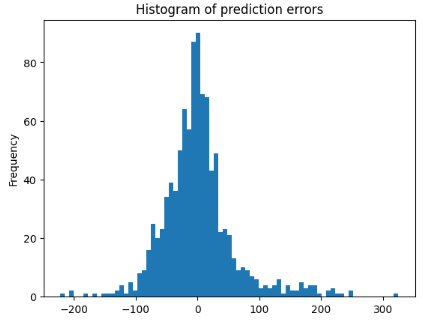

# Analysis_AirBnB_Boston

# Project overview
This is the first project of Udacity's Data Scientist Nanodegree. The objective is two-fold:
- provide an insightful technical analysis of Airbnb offering in Boston, USA. Data from September 2022 has been used for this analysis which can be found in this readme file and associated jupyter notebook included in this repository.
- write a blogpost explaining the findings in non-technical terms to address the largest, non-technical, audience. The associated blogpost can be found [here](https://laurentveyssier.github.io/Analysis_AirBnB_Boston/).

This analysis combines various techniques as our dataset requires numerical, statistical, NLP type of analysis. The project will be conducted following this framework:
- Framing key relevant business questions worth analyzing
- Data understanding
- Data preparation for the analysis and modeling steps
- Data analysis and modeling (including regression model for price prediction)
- Result evaluation
The deployment is not covered here. The trained model artifact could nevertheless be used for inference using an API.

# Acknowledgement and dataset overview
The Boston datasets I used were up-to-date at the time of my analysis. These were extracted in September 2022 by Airbnb Inside and the originals can be found [here](http://insideairbnb.com/explore). Airbnb Inside regularly provides up-to-date datasets for most major cities around the world.

The datasets are composed of 3 files which can be found in the `Datasets` folder of this repository. Those 3 files cover:
- Listings.csv which includes the full description of each properties, owner datails and several review kpis and scores
- Reviews.csv which includes unique id for each reviewer and detailed comments
- Calendar.csv which includes property id, the daily rental price and availability by day from September 15, 2022 onwards. This file provides a snapshot of the reservations as of september and looking forward into the year 2023.

# Key Business questions and project challenge
The analysis will answer 6 business questions as follows:
1. Price seasonality during the year - By how much do prices spike?
2. What are the busiest times of the year to visit Boston?
3. Is there a general upward trend of both new Airbnb listings and total Airbnb visitors to Boston?
4. Can you describe the vibe of each Boston neighborhood using listing descriptions?
5. Can you predict the rental price of a new property based on available features ?
6. Can the property text description from the host improve the prediction ?

Key challenge comes from the following real-life constraint: We want to provide the best possible prediction model for an new Airbnb property assuming we will not have part of the datailed KPis regarding reviews and host. Indeed, this being a new property added to Airbnb, we assume we can only rely on the property detailed description, localization and service offering prepared by the future new host.

# How to use and reproduce the analysis
The detailed, step-by-step, analysis is performed in the jupyter notebook `Boston_Airbnb_analysis.ipynb` provided in the project repository.
The notebook was executed under windows python v3.8 in a virtual environment. It will require a set of standard packages reflected by the list of imports found in the notebook. 
The datasets are provided in the datasets folder.
For additional model experiments during preliminary exploratory work please check out the other notebook `additional_modeling_experiments.ipynb`.

# Answers to Business questions 1 to 5
These can be found in the notebook with detailed working steps and conclusions.

# Regression Model with `price` as target variable
We will summarize here the results for Question 6. Detailed steps can be found in the notebook.
Because we want to propose a price-point for a new property, I chose to rely on features available in such situation. These cover:
- property localization
- property capacity
- property service offering referred as `amenities`
- property description by the host to be posted onto Airbnb platform

Under this constraint, I used a total of 5,841 features corresponding to:
- 5 continuous variables: 'accommodates','bedrooms','beds','latitude','longitude'
- 4 categorical variables encoded using one-hot vectors: 'property_type','room_type','bathrooms_text','neighbourhood_cleansed'
These features capture the gist of the property localization, property type and capacity. These variables were complemented by 
- 1,125 feature vectors corresponding to the items composing `amenities` list at each property (1 item = 1 binary column vector encoding the item presence or not at each property)
- Another sparse matrix corresponding to the top words occurence extracted from the property `description` field with 4,619 columns (or words). The sparse matrix corresponds to the word-occurence matrix from corpus of descriptions vectorized using nltk.

 Analysis was performed on a dataset of size 4,921 rental properties (after elimination of `price` outliers using 1.5 x IQR). 20% were reserved for model performance evaluation and 80% used for training.

# Regression prediction performance

Baseline performance measures without description-based features and using a ridge linear model:
- RMSE: 60.3 USD
- R² coefficient: 0.65

Best performance measured on the test set is achieved with XGBoostRegressor model using cross-validation:

| Metric  | Baseline model | excl. description features | incl. description features |
| ------------- | ------------- | ------------- | ------------- |
| RMSE  | 69.3  | 61.9  | 59.0  |
| R²  | 0.65  | 0.72  | 0.75  |

Both RMSE and R² coefficient further improve using text-based description features. 

Prediction performance using our best model following hyper-parameter tuning:

Our prediction error distribution is nicely in the form of a gaussian. This means the error is equally over or below the ground thruth.

