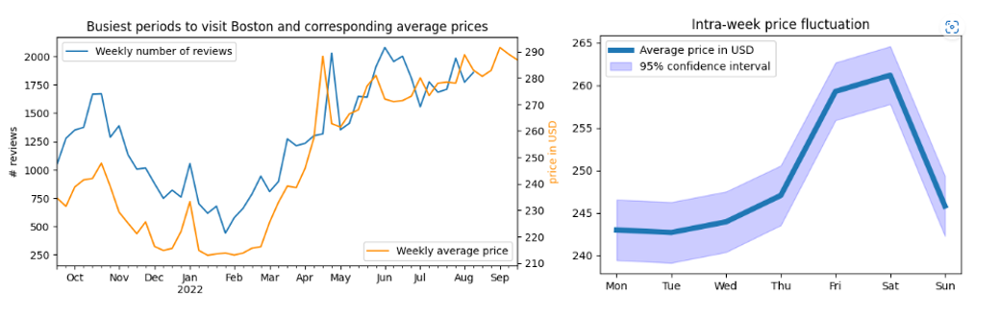
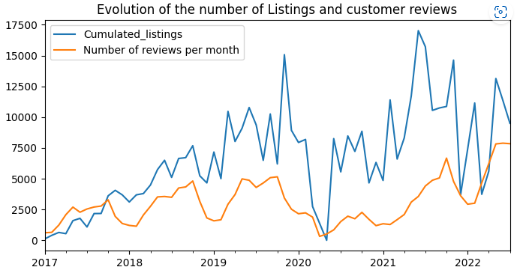
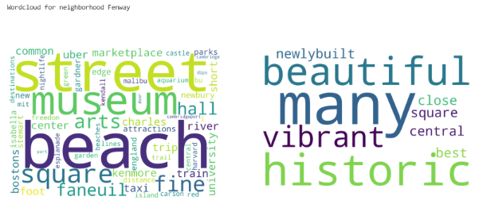
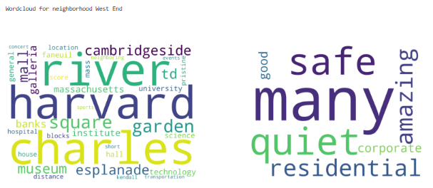
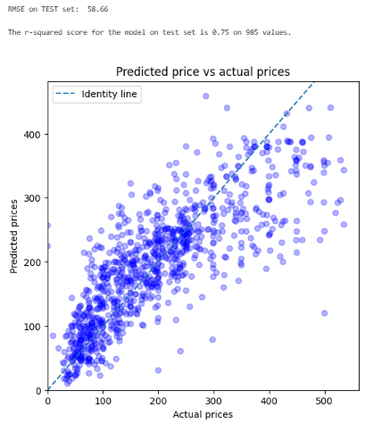

# How would you price an Airbnb appartment in Boston using Machine Learning ?

# INTRODUCTION

Have you ever wondered why such Airbnb appartment was so expensive compared to other similar-looking alternatives ? or wished to find the best value-for-money bargain for your next vacations ?

In this blogpost, we will explore Airbnb offering in Boston, USA.  The analysis dives into Airbnb data from September 2022 and answers four questions you may wish to know. Finally, our key findings might hopefully help you better understand the price-point of your next Airbnb reservation !

So let's dive in the 4 questions we will cover together:
1. What are the busiest times of the year to visit Boston? By how much do prices spike?
2. Is there a general upward trend of both new Airbnb listings and total Airbnb visitors to Boston? Is there a before and after COVID era ?
3. What is the vibe of each Boston neighborhood based on listing descriptions?
4. How to predict the rental price of a new property ? Which are the features valued most by the hosts or those driving prices up ?

# OUR KEY FINDINGS

**QUESTION #1: What are the busiest times of the year to visit Boston? By how much do prices spike?**

Using the date and number of reviews as a proxy for rental demand, our analysis reveals large price seasonality following touristic periods.
The busiest times of the year to visit Boston will be during the months of April and October as well as during summer from June till end of August, even extending till end of November as visible during 2018-2019. The prices will be inflated during these periods and one could find significantly lower prices in March or even September.
With additional flexibility, it is worth noting prices are also much lower on Sundays and during the first half of a week. They are at their highest during Fridays to Saturdays.

**QUESTION #2: Is there a general upward trend of both new Airbnb listings and total Airbnb visitors to Boston? Is there a before and after COVID ?**

Looking at the data over the last years, we can clearly see a growing trend in both the number of properties available and the number of visitors posting reviews about their stay. Additionally, there is an observable drop in 2020 due to the COVID lockdowns and travel restrictions, yet we believe that:
- a catch-up in tourism drove higher activity during the second part of 2021,
- and the level of visits seems to have stabilized back to pre-COVID levels in the months of 2022.

The below graph desmonstrates these points.

**QUESTION #3: What is the vibe of each Boston neighborhood based on listing descriptions?**

Hosts provide a description of the neighborhood which we used to determine the profile of each surroundings. While prices vary from neighborhood to neighborhood (details not discussed here but available in the full analysis - see at the bottom of this post if you are interested), prices can also be influenced by the vibe of each part of Boston. To answer this question, we looked at the adjectives used by the owners to get a feeling about each neighborhood. Additionally, we looked at the most frequent nouns and verbs to shape an understanding of what each district has to offer.

Below is an example depicting **Fenway** neighborhood. "Beautiful", "vibrant" and "historic" come first. Arts Museum, nightlife and access to numourous attractions finalize the picture.

Alternatively, **West End** emphasizes the proximity to the "amazing" Charles River, Cambridge and Harvard square, museums and other famous places from this "quiet" and "residential" neighborhood.

You can find all 26 neighborhoods in my detailed analysis (link at the end of my post).

**QUESTION #4: How to predict the rental price of a new property ? Which are the features valued most by the hosts or those driving prices up ?**

I took the challenge to train a machine learning model using relevant characteristics of a property to estimate its price-point. Provide information on localization (neighborhood, latitude, longitude), housing capacity (number of bedrooms, number of guests,...) and detailed list of services and facilities (bathrooms, appliances, facilities such as gym or paid parking...) and the model will suggest a rental price !

Key price predictors appear to be the room type, the housing capacity and the facility/service offering which can justify pushing prices up. For example a gym, an elevator or a dedicated workspace get a premium as well those offering full serviced facility. Interestingly, properties with 1 bath seems to suffer reduced price. We could hypothetize that a shower is preferred and drives a premium. On the opposite, a dishwasher does not seem to attract much price premium. Finally, the localization (latitude and longitude) has an influence, with diminishing prices as we move away South and from the center.

Using natural language processing to extract key information such as word frequencies from the owner's description brought additional precision to the prediction model.

We explored the influence of main features on price. These appear to be the room type, the housing capacity and the facility/service offering such as fully-serviced places. Such amenities justify pushing prices up. On the contrary, no private room implies a substantial discount.

# CONCLUSION

The analysis of September 2022 Airbnb Boston data helped to identify the busiest periods to visit the city as well as the rental price dynamic closely following touristic activity. 

We observed the steady growth in both Airbnb offering and the number of visits. 

Data analytics and natural language processing, applied to the short description of the neighborhoods from the host, enabled to prepare a profile of each of them. 

Finally we used the characteristics of Airbnb properties to train a machine learning model and predict the rental price of a given location.

# Interested to go deeper into the analysis and its technical aspects?
The detailed, step-by-step, analysis can be found [here](https://github.com/LaurentVeyssier/Analysis_AirBnB_Boston). The analysis leverages data science, machine learning and natural language processing techniques to derive the above conclusions.

# Acknowledgement
The Boston datasets are provided by Airbnb Inside and can be found [here](http://insideairbnb.com/explore). Airbnb Inside regularly provides up-to-date datasets for most major cities around the world.
