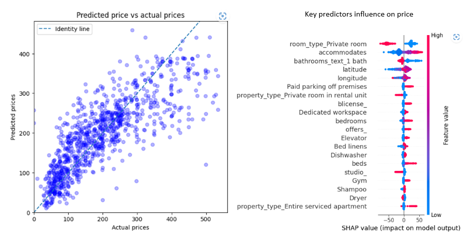

# Analysis_AirBnB_Boston

# Introduction

Have you ever wondered about Airbnb rental price differencies between properties you could not clearly understand ? or thought such apartment looked somehow over-priced ?
In this blogpost, we will explore Airbnb offering in Boston, USA.  The analysis dives into Airbnb data from September 2022 and answers four questions you may not know. Finally, our key findings might hopefully help you better understand the price-point of your next Airbnb reservation !

So let's dive in the 4 questions we will cover together:
1. What are the busiest times of the year to visit Boston? By how much do prices spike?
2. Is there a general upward trend of both new Airbnb listings and total Airbnb visitors to Boston? Is there a before and after COVID era ?
3. What is the vibe of each Boston neighborhood based on listing descriptions?
4. How to predict the rental price of a new property ? Which are the features valued most by the hosts or those driving prices up ?

# SUMMARY OF KEY FINDINGS

**1.QUESTION #1: What are the busiest times of the year to visit Boston? By how much do prices spike?**

Using the date and number of reviews as a proxy for rental demand, our analysis reveals large price seasonality following touristic periods.
The busiest times of the year to visit Boston will be during the months of April and October as well as during summer from June till end of August, even extending till end of November as visible during 2018-2019. The prices will be inflated during these periods and one could find significantly lower prices in March or even September.
With additional flexibility, it is worth noting prices are also much lower on Sundays and during the first half of a week. They are at their highest during Fridays to Saturdays.

**2. QUESTION #2: Is there a general upward trend of both new Airbnb listings and total Airbnb visitors to Boston? Is there a before and after COVID era ?**

Looking at the data over the last years, we can clearly see a growing trend in both the number of properties available and the number of visitors posting reviews about their stay. Additionally, following the observable drop due to the COVID lockdowns and travel restrictions, we believe that:
- a rebound drove higher activity during the second part of 2021,
- the level of visits has in the last months of 20222 stabilized back to pre-COVID levels.

**3. QUESTION #3: What is the vibe of each Boston neighborhood based on listing descriptions?**

Hosts provide description of the neighborhood which we have used to determine the profile of each of them. While prices vary from neighborhood to neighborhood (details not discussed here but available in the full analysis - see at the bottom of this post), this can also be correlated with the vibe of each part of Boston. We looked for the adjectives used by the owners to get a feeling about each neighborhood. Additionally, we looked at the nouns and verbs mostly used to get some understanding of what each district has to offer.

**4. QUESTION #4: How to predict the rental price of a new property ? Which are the features valued most by the hosts or those driving prices up ?**

# Interested to go deeper into the analysis and its technical aspects?
The detailed, step-by-step, analysis can be found [here](). The analysis leverages data science, machine learning and natural language processing tools and techniques driving the above conclusions.

# Acknowledgement
The Boston datasets are provided by Airbnb Inside and can be found [here](http://insideairbnb.com/explore). Airbnb Inside regularly provides up-to-date datasets for most major cities around the world.

The datasets are composed of 3 files which can be found in the `Datasets` folder of this repository. Those 3 files cover:
- Listings.csv which includes the full description of each properties, owner datails and several review kpis and scores
- Reviews.csv which includes unique id for each reviewer and detailed comments
- Calendar.csv which includes property id, the daily rental price and availability by day from September 15, 2022 onwards. This file provides a snapshot of the reservations as of september and looking forward into the year 2023.

# Key Business questions and project challenge

Key challenge comes from the following real-life constraint: We want to provide the best possible prediction model for an new Airbnb property assuming we will not have part of the datailed KPis regarding reviews and host. Indeed, this being a new property added to Airbnb, we assume we can only rely on the property detailed description, localization and service offering prepared by the future new host.

# Regression Model with `price` as target variable
We will summarize here the results for Question 6. Detailed steps can be found in the notebook.
Because we want to propose a price-point for a new property, I chose to rely on features available in such situation. These cover:
- property localization
- property capacity
- property service offering referred as `amenities`
- property description by the host to be posted onto Airbnb platform

Under this constraint, I used a total of 5,841 features corresponding to:
- 5 continuous variables: 'accommodates','bedrooms','beds','latitude','longitude'
- 4 categorical variables encoded using one-hot vectors: 'property_type','room_type','bathrooms_text','neighbourhood_cleansed'
These features capture the gist of the property localization, property type and capacity. These variables were complemented by 
- 1,125 feature vectors corresponding to the items composing `amenities` list at each property (1 item = 1 binary column vector encoding the item presence or not at each property)
- Another sparse matrix corresponding to the top words occurence extracted from the property `description` field with 4,619 columns (or words). The sparse matrix corresponds to the word-occurence matrix from corpus of descriptions vectorized using nltk.

 Analysis was performed on a dataset of size 4,921 rental properties (after elimination of `price` outliers using 1.5 x IQR). 20% were reserved for model performance evaluation and 80% used for training.

# Regression prediction performance

Baseline performance measures without description-based features and using a ridge linear model:
- RMSE: 60.3 USD
- R² coefficient: 0.65

Best performance measured on the test set is achieved with XGBoostRegressor model using cross-validation:

| Metric  | Baseline model | excl. description features | incl. description features |
| ------------- | ------------- | ------------- | ------------- |
| RMSE  | 69.3  | 61.9  | 58.6  |
| R²  | 0.65  | 0.72  | 0.75  |

Both RMSE and R² coefficient further improve using text-based description features. 

Prediction performance using our best model following hyper-parameter tuning:

Our prediction error has a nice gaussian distribution shape. This means the error is equally over or below the ground thruth.

Using Shap library, we finally explore the influence of most influential features on price. These appear to be the room type, the capacity and various facility/service offering (paid-parking, fully-serviced, gym, elevator...). Such amenities justify pushing prices up. On the contrary, no private room implies a substantial discount.

